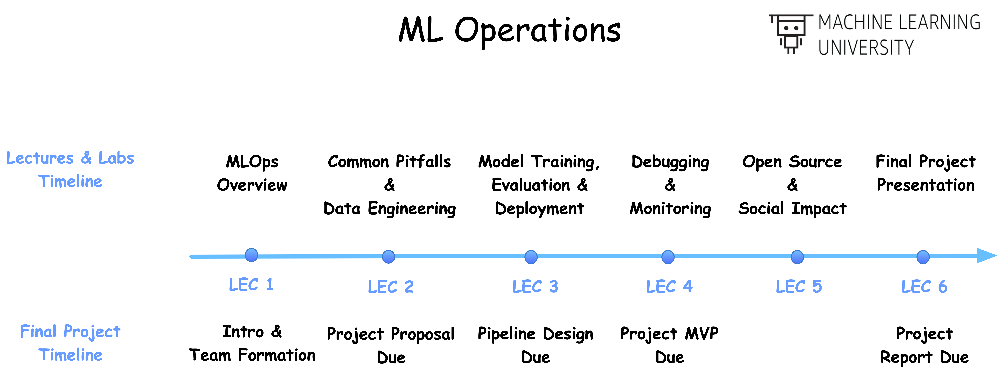

# MLU-MLOps Lab
For lecture usage on the ML Operation (MLOps) course in Amazon Machine Learning University (MLU).

## Introduction

Data Scientists and ML developers need more than a Jupyter notebook to create a ML model, to test it, to put it into production and to integrate it with a portal and/or a basic web/mobile application, in a reliable and flexible way. 

    

There are two basic questions that you should consider when you start developing a ML model for a real Business Case:

1. How long would it take your organization to deploy a change that involves a single line of code?
2. Can you do this on a repeatable, reliable basis?

So, if you're not happy with the answers you have, MLOps is a concept that can help you: 
- a) to create or improve the organization culture for CI/CD applied to ML; 
- b) to create an automated infrastructure that will support your processes.

In this course, we will first overview how to architect end-to-end ML systems: from initial ML project scoping to data ingestion, from model training and deployment, to model serving, monitoring and maintenance. Through the lectures, we will explore the ML Systems of several key products and services within Amazon to get you inspired with a varied of ML system decisions. Beside, by reviewing some ML pitfalls, we provide some practical solutions for you to debug the ML systems.

We structure the course as following:

* Lecture 1: *what components* needed for an ML system (via an MiniAmazonGo example)
* Lecture 2: what *questions (choices) to ask* for each component
* Lecture 3-4: what *options* (answers to above questions) do you have for each component
* Lecture 5: what *consequence* to be aware of (monitoring, social impact, etc.)

## Pre-Requisites

### Knowledge Check

You should have some basic experience with:
  - Train/test a ML model
  - Python ([scikit-learn](https://scikit-learn.org/stable/#))
  - [Jupyter Notebook](https://jupyter.org/)
  - [AWS CodePipeline](https://aws.amazon.com/codepipeline/)
  - [AWS CodeCommit](https://aws.amazon.com/codecommit/)
  - [AWS CodeBuild](https://aws.amazon.com/codebuild/)
  - [Amazon ECR](https://aws.amazon.com/ecr/)
  - [Amazon SageMaker](https://aws.amazon.com/sagemaker/)
  - [AWS CloudFormation](https://aws.amazon.com/cloudformation/)

Some experience working with the AWS console is helpful as well.

### AWS Account

 You'll need an AWS Account with access to the services above. There are resources required by this workshop that are eligible for the [AWS Free Tier](https://aws.amazon.com/free/) if your account is less than 12 months old. 

## Scenario

In this course, you'll implement and experiment a basic MLOps process, supported by an automated infrastructure for training/testing/deploying/integrating ML Models. It is comprised into four parts:

1. You'll start with a **WarmUp**, for reviewing the basic features of Amazon Sagemaker;
2. Then you will **optionally** create a **Customized Docker Image** with your own algorithm. We'll use scikit-learn as our library;
3. After that, you will train the model (using the buil-in XGBoost or the a custom container if you ran the step 2), deploy them into a **DEV** environment, approve and deploy them into a **PRD** environment with **High Availability** and **Elasticity**;
4. Finally, you'll run a Stress test on your production endpoint to test the elasticity and simulate a situation where the number of requests on your ML model can vary.

Parts 2 and 3 are supported by automated pipelines that reads the assets produced by the ML devoloper and execute/control the whole process.

### Architecture
For part 2 the following architecture will support the process. In part 2 you'll create a Docker image that contains your own implementation of a RandomForest classifier, using python 3.7 and scikit-learn. Remember that if you are happy with the [built-in XGboost](https://docs.aws.amazon.com/sagemaker/latest/dg/xgboost.html) you can skip this part.

1. The **ML Developer** creates the assets for Docker Image based on Scikit Learn, using Sagemaker, and pushes all the assets to a Git Repo (CodeCommit);
2. CodePipeline listens the push event of CodeCommit, gets the source code and launches CodeBuild;
3. CodeBuild authenticates into ECR, build the Docker Image and pushes it into the ECR repository
4. Done.

For part 3 you'll make use of the following structure for training the model, testing it, deploying it in two different environments: DEV - QA/Development (simple endpoint) and PRD - Production (HA/Elastic endpoint).

**Altough there is an ETL part in the Architecture, we'll not use Glue or other ETL tool in this workshop. The idea is just to show you how simple it is to integrate this Architecture with your Data Lake and/or Legacy databases using an ETL process**

1. An ETL process or the ML Developer, prepares a new dataset for training the model and copies it into an S3 Bucket;
2. CodePipeline listens to this S3 Bucket, calls a Lambda function for start training a job in Sagemaker;
3. The lambda function sends a training job request to Sagemaker;
4. When the training is finished, CodePipeline gets its status goes to the next stage if there is no error;
5. CodePipeline calls CloudFormation to deploy a model in a Development/QA environment into Sagemaker;
6. After finishing the deployment in DEV/QA, CodePipeline awaits for a manual approval
7. An approver approves or rejects the deployment. If rejected the pipeline stops here; If approved it goes to the next stage;
8. CodePipeline calls CloudFormation to deploy a model into production. This time, the endpoint will count with an AutoScaling policy for HA and Elasticity.
9. Done.

## Instructions

First, you need to execute a CloudFormation script to create all the components required for the exercises.

1. Select the below to launch CloudFormation stack.

Region| Launch
------|-----
US East (N. Virginia) | 

1. Then open the Jupyter Notebook instance in Sagemaker and start doing the exercises:

    1. [Warmup](lab/00_Warmup/01_BasicModel_Part1_TrainDeployTest.ipynb): This is a basic exercise for exploring the Sagemaker features like: training, deploying and optmizing a model. If you already have experience with Sagemaker, you can skip this exercise.
    2. [Container Image with a Scikit Classifier](lab/01_CreateAlgorithmContainer/01_Creating%20a%20Classifier%20Container.ipynb 	): In this exercise we'll create a Docker Image that encapsulates all the code required for training and deploying a RandomForest classifier. If you don't want to create a custom container, skip this section.
        1. [Test the models locally](lab/01_CreateAlgorithmContainer/02_Testing%20our%20local%20model%20server.ipynb): This is part of the exercise #3. You can use this jupyter to test your local WebService, to simulate how Sagemaker will call it when you ask it to create an Endpoint or launch a Batch job for you.
        2. [Test the container using a SageMaker Estimator](lab/01_CreateAlgorithmContainer/03_Testing%20the%20container%20using%20SageMaker%20Estimator.ipynb): This optional exercise can be use for understanding how SageMaker Estimators can encapsulate your container and abstract the complexity of the training/tuning/deploying processes.
    4. [Train your models](lab/02_TrainYourModel/01_Training%20our%20custom%20model.ipynb): In this exercise you'll use the training pipeline. You'll see how to train or retrain a particular model by just copying a zip file with the required assets to a given S3 bucket.
        1. [Check Training progress and test](lab/02_TrainYourModel/02_Check%20Progress%20and%20Test%20the%20endpoint.ipynb): Here you can monitor the training process, approve the production deployment and test your endpoints.
    5. [Stress Test](lab/03_TestingHacking/01_Stress%20Test.ipynb): Here you can execute stress tests to see how well your model is performing.

----
# Cleaning

First delete the folowing stacks:
 - mlops-deploy-iris-model-dev
 - mlops-deploy-iris-model-prd
 - mlops-training-iris-model-job

Then delete the stack you created. If you named **AIWorkshop**, find this stack using the CloudFormation console and delete it.

**WARNING**: All the assets will be deleted, including the S3 Bucket and the ECR Docker images created during the execution of this workshop.

----
# Suggested agenda
 - Introduction (1:00)
   - MLStack@AWS, SageMaker concepts/features, MLOps, etc.
 - WarmUp - Part 1 (0:30)
 - Break (0:15)
 - WarmUp - Parts 2,3,4 (0:50)
 - Container Image (0:40)
 - Lunch (1:00)
 - MLOps Pipeline: Train + Deployment (0:30)
 - Stress tests + Auto Scaling (0:30)
 - Wrap up + discussion (0:20)

Total: 5:45
 
----
## License Summary
This sample code is made available under a modified MIT license. See the LICENSE file.

Thank you!
# amazon-sagemaker-mlops-workshop
